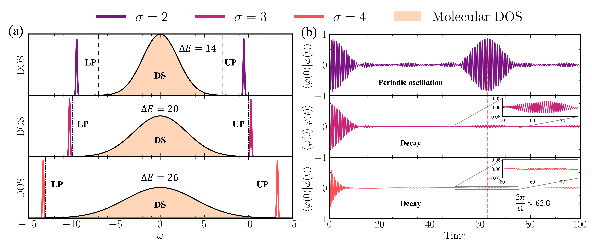

<p align="center">
  <a href="https://github.com/Weitheskmt/WeiGPS" target="_blank" >
    
  </a>
</p>
<p align="center">
    <a href="https://github.com/Weitheskmt/WeiGPS/LICENSE" target="_blank">
        
    </a>
    <a href="https://pypi.org/project/weigps/"  target="_blank">
        
    </a>
</p>


## Table of contents
* [Description](#description)
* [Dependencies and installation](#dependencies-and-installation)
* [Examples and Tutorials](#examples-and-tutorials)
* [Using WeiGPS](#using-weigps)
* [References](#references)

## Description

**WeiGPS** is a Python package designed for **Gas-phase Polariton Simulation (GPS)**, a numerical method than can simulate more than 1 million molecules. It provides a comprehensive and user-friendly interface for performing GPS, making it a valuable tool for researchers working in polariton chemistry.

With WeiGPS, users can easily manage parameters, calculate density of states, and calculate correlation function. See the [**Examples**](#examples-and-tutorials) section below and the [**Tutorials**](tutorials) to have an idea of the potential of this package. Also see the diagram below for a summary of all available tools and functionalities. 

<p align="center">
    
</p>

<p align="center">
    
</p>

## Dependencies and installation

### Installing via PIP
WeiGPS is available on [PyPI](https://pypi.org/project/weigps), therefore you can install the latest released version with:
```bash
> pip install weigps
```

### Installing from source
To install the bleeding edge version, clone this repository with:
```bash
> git clone https://github.com/Weitheskmt/WeiGPS
```

and then install the package in [development mode](https://setuptools.pypa.io/en/latest/userguide/development_mode.html):
```bash
> pip install -e .
```

### Dependencies
The core features of **WeiGPS** depend on `numpy` and `scipy`. In order to use the plotting functionalities you will also need `matplotlib`.

## Examples and Tutorials
You can quickly know how to use the package in the [tutorials](tutorials/fast_use/test.ipynb).

## Using WeiGPS
To perform GPS, simply begin by initializing a WeiGPS module that implements your GPS method of choice. Here, we demonstrate how a user might build a customized WeiGPS model. Models may then be fitted by calling the `fit()` method and passing in the necessary data.
```python3
from weigps import WeiGPS

# Build a Wei's GPS (WeiGPS) model with input file (json_file_path).
GPS = WeiGPS(json_file_path)

# get density of states (DOS).
w_GPS, p_GPS = GPS.get_DOS(
    k=20, # the number of eigenvalues and corresponding eigenvectors needed to be calculated. Time bottleneck.
)

# quickly plot DOS
GPS.plot_spectrum(
  w_GPS, # axis-x
  p_GPS, # axis-y
  SAVE=True, # if True, save data as ".npy" in "./data" folder.
  PLOT=True  # if True, plot and save figures in "./figs" folder.
)

# get correlation function (CORR).
TIME_GPS, observable_GPS = GPS.run_dynamics()

# quickly plot CORR.
GPS.plot_corr(
  TIME_GPS, # axis-x
  observable_GPS, # axis-y
  SAVE=True, # if True, save data as ".npy" in "./data" folder.
  PLOT=True # if True, plot and save figures in "./figs" folder.
  )

# We can also build a non-Floquet version (WeiNoF) with the same input file (json_file_path).
from weigps import WeiNoF

NoF = WeiNoF(json_file_path)

# get density of states (DOS).
w_NoF, p_NoF = NoF.get_DOS(
    k=20, # the number of eigenvalues and corresponding eigenvectors needed to be calculated. Time bottleneck.
    t=0 # which time snapshot of DOS 
)

# Other usages are the same with WeiGPS.


```
## References

To implement the various versions of the DMD algorithm we follow these works:
* **WeiGPS:** Wei Liu, Jingqi Chen and Wenjie Dou. *Polaritons under Extensive Disordered Gas-phase Molecular Rotations in a Fabry-P\ ́erot Cavity*. Stay tune.
